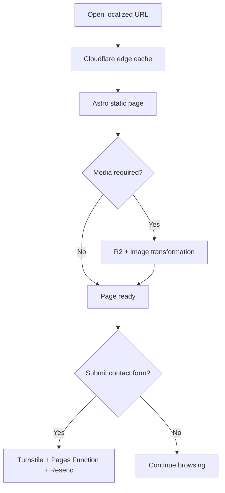
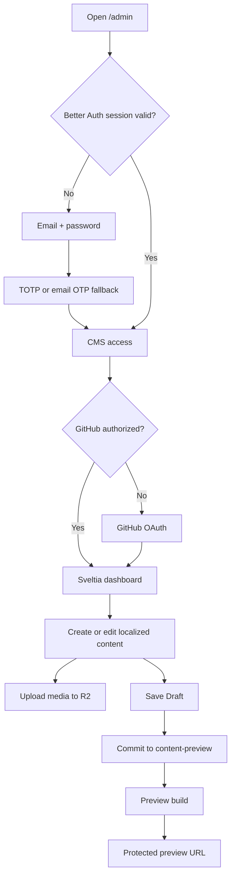
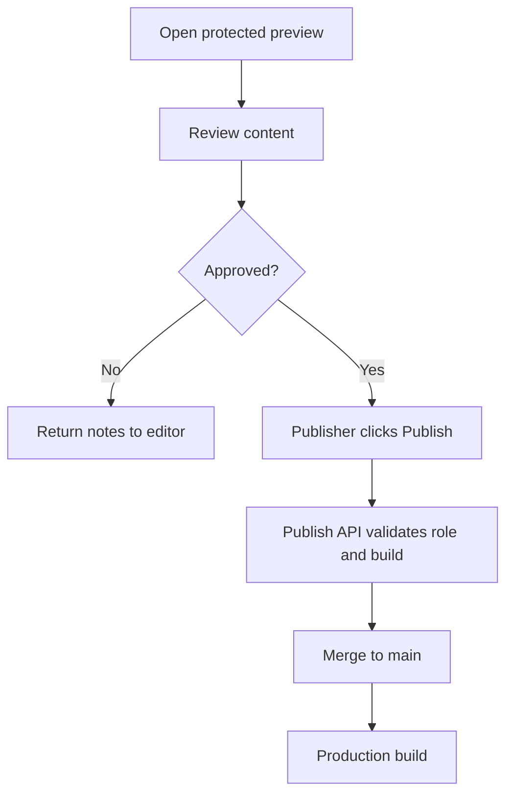
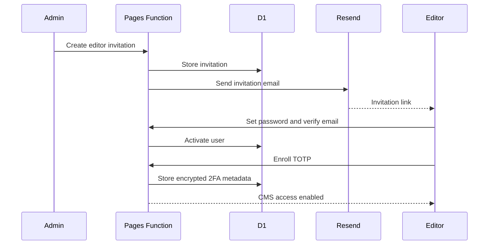
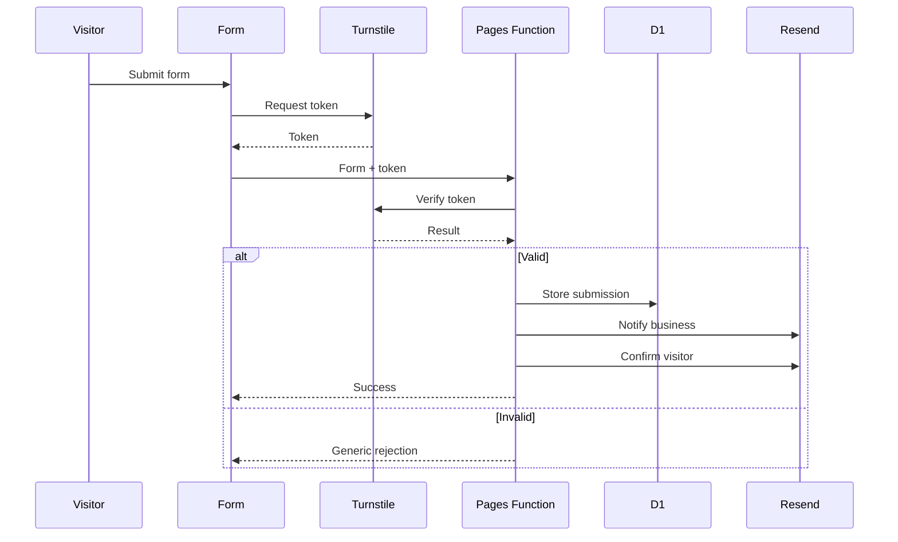

# PLAN.md — astro-sveltia-cloudflare

> **Status:** Implementation Plan v2.0  
> **Tanggal:** 23 Juni 2026  
> **Project:** `astro-sveltia-cloudflare`  
> **Target lisensi:** MIT  
> **Target deployment:** Cloudflare Pages + Pages Functions + D1 + R2 + Worker Cron + Image Transformations  
> **Package manager:** pnpm  
> **Runtime development:** Node.js 24 LTS  
> **Bahasa utama source code:** TypeScript  
> **Locale default:** Indonesian (`id`)  
> **Locale kedua:** English (`en`)  

---

## 1. Executive Summary

`astro-sveltia-cloudflare` adalah boilerplate multilingual untuk website marketing, blog, services, pricing, contact, dan documentation portal yang production-ready, Git-backed, static-first, dan dapat dikelola editor melalui browser.

Boilerplate ini menggabungkan:

- **Astro** untuk website statis berperforma tinggi.
- **Starlight** untuk dokumentasi multilingual.
- **Sveltia CMS** untuk pengelolaan konten melalui `/admin`.
- **GitHub** sebagai source of truth untuk Markdown, MDX, dan YAML.
- **Cloudflare Pages** untuk hosting website statis.
- **Cloudflare Pages Functions** untuk auth, middleware, contact form, build status, dan publish action.
- **Cloudflare D1** untuk user, session, role, 2FA, invitation, audit, dan contact submissions.
- **Cloudflare R2** untuk media dan file publik.
- **Cloudflare Image Transformations** untuk optimized image variants.
- **Cloudflare Worker Cron** untuk media cleanup job.
- **Cloudflare Turnstile** untuk proteksi contact form dan flow sensitif.
- **Better Auth** untuk email/password, session, role, OTP, TOTP, backup code, dan trusted device.
- **Resend** untuk email verification, reset password, OTP, contact notification, dan security notification.
- **GitHub OAuth melalui Sveltia CMS Authenticator** untuk memberi Sveltia hak menulis ke repository.
- **i18n Indonesian dan English** dengan URL prefix, canonical, dan hreflang.
- **Preview content workflow** melalui branch `content-preview` dan protected preview deployment.
- **Analytics adapter** untuk GTM atau Umami.
- **SEO dan AI discovery** melalui semantic HTML, JSON-LD, sitemap, RSS, structured content, dan optional `llms.txt`.
- **Project-scoped agent skills** dari `skills.sh` dengan source commit yang dipin dan direview.

Halaman inti yang tersedia langsung:

- Homepage;
- About;
- Services listing dan detail;
- Pricing;
- Contact dengan Google Maps;
- Blog;
- Starlight documentation;
- legal pages.

Prinsip utamanya adalah **static-first**, **Git-backed content**, **editor-friendly CMS**, **security by default**, **multilingual from day one**, dan **dynamic only where needed**.

## 2. Tujuan

### 2.1 Tujuan Utama

1. Menyediakan starter Astro production-ready yang bisa di-clone dan disesuaikan dengan cepat.
2. Memungkinkan editor mengelola konten dari browser melalui `/admin` tanpa mengedit file secara manual.
3. Menyediakan Indonesian dan English sejak implementasi pertama.
4. Menyediakan Homepage, About, Services, Pricing, Contact, Blog, dan Docs sebagai halaman inti.
5. Menyimpan konten dalam Markdown/MDX/YAML agar portable dan version-controlled.
6. Menyediakan branch-based draft, preview, review, dan publish flow.
7. Menyimpan media di R2 agar repository tidak membengkak.
8. Menyediakan image transformations melalui preset yang aman.
9. Menyediakan media cleanup job dengan dry-run, grace period, dan quarantine.
10. Menyediakan autentikasi email dengan Resend dan mandatory 2FA.
11. Menyediakan contact form yang dilindungi Turnstile dan terhubung ke Resend.
12. Menyediakan Google Maps yang dapat dikonfigurasi dari CMS.
13. Menyediakan analytics adapter untuk GTM dan Umami.
14. Menyediakan baseline technical SEO, structured data, sitemap, RSS, hreflang, dan AI discovery.
15. Menjalankan mayoritas workload pada Cloudflare tanpa server dedicated.
16. Menyediakan security, testing, CI, deployment, recovery, dan operational runbook.
17. Menyediakan project-scoped agent skills yang direview dan dipin.
18. Tetap mudah di-fork untuk project klien tanpa membawa kompleksitas platform enterprise yang tidak diperlukan.

### 2.2 Sasaran Pengguna

| Persona | Kebutuhan |
|---|---|
| Visitor | Membuka website, blog, layanan, harga, kontak, dan dokumentasi dengan cepat |
| Editor | Membuat content, translation, dan draft melalui CMS |
| Reviewer | Memeriksa protected preview tanpa mengubah content |
| Publisher | Menerbitkan preview yang sudah disetujui ke production |
| CMS Admin | Mengelola editor, role, konfigurasi CMS, dan content schema |
| Technical Admin | Mengelola GitHub, Cloudflare, OAuth, D1, R2, Worker, secrets, dan deployment |
| Developer | Mengembangkan komponen, schema, integrations, tests, dan automation |

## 3. Non-Goals

MVP tidak ditujukan untuk:

- e-commerce lengkap;
- membership berbayar;
- multi-tenant SaaS;
- realtime collaborative editing;
- visual page builder bebas seperti Webflow;
- workflow approval kompleks;
- database-driven content publik;
- dynamic personalization skala besar;
- customer portal dengan transaksi;
- menggantikan DAM enterprise;
- menggantikan GitHub sebagai source of truth;
- menyembunyikan sepenuhnya kebutuhan GitHub OAuth dari editor Sveltia.

> **Batasan penting:** editor tidak perlu membuka atau mengelola repository GitHub secara manual, tetapi pada arsitektur Sveltia standar setiap editor tetap perlu mengotorisasi GitHub dan memiliki izin yang sesuai ke repository. Better Auth melindungi akses CMS, sedangkan GitHub OAuth memberi Sveltia izin melakukan commit.

---

## 4. Prinsip Arsitektur

1. **Static by default**  
   Halaman publik dan dokumentasi dibangun menjadi file statis.

2. **Dynamic only where needed**  
   Pages Functions hanya digunakan untuk auth, middleware, dan endpoint terbatas.

3. **Git as content source of truth**  
   Konten website disimpan sebagai Markdown, MDX, JSON, atau YAML.

4. **R2 for binary assets**  
   Gambar, PDF, video pendek, dan file unduhan tidak disimpan di Git.

5. **No public signup by default**  
   Akun CMS dibuat atau diundang oleh admin.

6. **Two layers of authorization**  
   Better Auth menentukan siapa yang boleh membuka CMS. GitHub menentukan siapa yang boleh menulis ke repository.

7. **Least privilege**  
   Semua token, role, binding, dan credential dibatasi pada resource yang diperlukan.

8. **Portable content**  
   Konten tetap dapat dibaca tanpa CMS dan dapat dipindahkan ke hosting lain.

9. **No unnecessary SPA**  
   Website publik tidak diubah menjadi aplikasi client-heavy hanya demi beberapa form.

10. **Configuration over customization**  
    Variasi antar-client diatur melalui configuration file, design tokens, content schema, dan feature flags sebelum membuat custom code.

---

## 5. Keputusan Arsitektur Utama

### ADR-001 — Astro Static Output

**Keputusan:** website menggunakan Astro static output.

**Alasan:**

- cocok untuk website content-heavy;
- deployment sederhana ke Cloudflare Pages;
- performa dan caching optimal;
- tidak membutuhkan server rendering untuk halaman publik;
- mengurangi biaya dan attack surface.

**Konsekuensi:**

- data yang harus selalu realtime perlu endpoint terpisah;
- route auth tidak dibuat sebagai Astro SSR route;
- endpoint dinamis ditempatkan di Cloudflare Pages Functions.

---

### ADR-002 — Starlight di `/docs`

**Keputusan:** Starlight ditambahkan ke project Astro yang sama dan diakses melalui `/docs`.

**Alasan:**

- satu domain;
- satu build pipeline;
- satu repository;
- search, navigation, code highlighting, i18n, SEO, dan accessibility sudah tersedia;
- dokumentasi bisa dikelola dari CMS yang sama.

---

### ADR-003 — Sveltia CMS Menggantikan Decap CMS

**Keputusan:** menggunakan Sveltia CMS sebagai Git-based CMS.

**Alasan:**

- UX lebih modern;
- kompatibilitas konfigurasi dengan banyak pola Decap;
- dapat berjalan sebagai static SPA;
- mendukung GitHub backend;
- mendukung upload langsung ke Cloudflare R2;
- tidak membutuhkan CMS server terpisah.

**Konsekuensi:**

- masih tergantung pada GitHub OAuth untuk operasi repository;
- konflik edit multi-user tetap perlu dikendalikan secara operasional;
- editorial workflow belum dijadikan dependency MVP.

---

### ADR-004 — Better Auth untuk Portal CMS

**Keputusan:** Better Auth dipakai untuk login email/password, session, role, dan 2FA.

**Alasan:**

- self-hosted;
- TypeScript-native;
- mendukung Cloudflare D1;
- mendukung email OTP, TOTP, backup code, dan trusted device;
- dapat diintegrasikan melalui Pages Functions.

**Konsekuensi:**

- terdapat login portal dan authorization GitHub sebagai dua mekanisme berbeda;
- perlu D1 migration;
- perlu email delivery dan anti-abuse controls.

---

### ADR-005 — Resend untuk Transactional Email

**Keputusan:** Resend digunakan untuk email auth.

**Email yang dicakup:**

- verifikasi alamat email;
- undangan editor;
- reset password;
- email OTP;
- notifikasi 2FA diaktifkan atau dinonaktifkan;
- notifikasi perubahan password;
- notifikasi login berisiko, bila diimplementasikan.

**Aturan domain:**

- gunakan subdomain khusus seperti `auth.example.com` atau `notifications.example.com`;
- jangan mengirim production email dari domain testing;
- SPF, DKIM, dan DMARC harus terverifikasi.

---

### ADR-006 — Cloudflare Pages Functions, Bukan Astro SSR

**Keputusan:** Astro tetap static. Auth API dan middleware ditulis di folder `/functions`.

**Alasan:**

- Cloudflare Pages tetap menjadi hosting utama;
- tidak membutuhkan adapter SSR Astro;
- D1 binding dapat diakses dari Pages Functions;
- route dinamis hanya memproses bagian yang memang dinamis.

---

### ADR-007 — R2 untuk Media

**Keputusan:** media CMS disimpan di R2 dan disajikan melalui custom domain.

**Contoh:**

```text
assets.example.com/uploads/2026/06/product-image.webp
```

**Konsekuensi:**

- konfigurasi CORS diperlukan;
- token R2 harus bucket-scoped;
- media deletion policy harus ditentukan;
- image optimization tidak otomatis dilakukan oleh R2.

---

### ADR-008 — Branch-Based Preview Workflow

**Keputusan:** MVP langsung menggunakan preview workflow berbasis branch, bukan direct publish dari CMS ke `main`.

Branch utama:

```text
main
content-preview
```

Perilaku:

```text
Save Draft
→ commit ke content-preview
→ Cloudflare preview build
→ protected preview
→ review
→ Publish action
→ merge ke main
→ production build
```

**Alasan:**

- editor harus dapat melihat hasil sebelum production;
- role editor dan publisher harus terpisah;
- draft tidak boleh langsung memengaruhi website publik;
- preview deployment memberi representasi yang lebih akurat daripada editor preview lokal;
- Sveltia tetap digunakan sebagai editor, sementara publish orchestration ditangani server-side.

**Konsekuensi:**

- perlu `content-preview` branch;
- perlu publish and discard endpoint;
- perlu protected preview environment;
- perlu build status integration;
- perlu conflict detection;
- preview analytics dan contact flow harus dinonaktifkan atau disandbox.

## 6. Arsitektur Tingkat Tinggi

```mermaid
flowchart TB
    Visitor[Visitor] --> Edge[Cloudflare Edge]
    Edge --> Pages[Cloudflare Pages]

    Pages --> Astro[Astro Static Website]
    Astro --> Home[Homepage]
    Astro --> About[About]
    Astro --> Services[Services]
    Astro --> Pricing[Pricing]
    Astro --> Blog[Blog]
    Astro --> Contact[Contact + Google Maps]
    Astro --> Docs[Starlight Docs]
    Astro --> I18N[i18n]
    Astro --> SEO[SEO + AI Discovery]
    Astro --> Analytics[Analytics Adapter]

    Contact --> Turnstile[Cloudflare Turnstile]
    Turnstile --> ContactAPI[Pages Function /api/contact]
    ContactAPI --> D1Contact[(D1 Contact Submissions)]
    ContactAPI --> Resend[Resend]

    Editor[Editor] --> AuthUI[/auth/sign-in]
    AuthUI --> AuthAPI[Pages Function /api/auth]
    AuthAPI --> D1Auth[(D1 Auth)]
    AuthAPI --> Resend
    AuthAPI --> AdminGuard[Admin Middleware]
    AdminGuard --> CMS[Sveltia CMS /admin]

    CMS --> GitHubOAuth[GitHub OAuth]
    GitHubOAuth --> PreviewBranch[(content-preview)]
    CMS --> R2[(Cloudflare R2)]

    PreviewBranch --> PreviewBuild[Cloudflare Preview Build]
    PreviewBuild --> PreviewSite[Protected Preview]

    Publisher[Publisher] --> PublishAPI[Pages Function /api/cms/publish]
    PublishAPI --> MainBranch[(main)]
    MainBranch --> ProductionBuild[Production Build]
    ProductionBuild --> Pages

    R2 --> Transform[Cloudflare Image Transformations]
    Cron[Worker Cron] --> Cleanup[Media Cleanup Job]
    Cleanup --> R2
```

## 7. User Journey

### 7.1 Visitor



### 7.2 Editor CMS



### 7.3 Reviewer and Publisher



### 7.4 Technical Admin

1. Menyiapkan repository dan branch protection.
2. Menyiapkan Cloudflare Pages dan preview environment.
3. Membuat D1 database per environment.
4. Membuat R2 bucket per environment.
5. Menyiapkan Worker Cron untuk cleanup.
6. Memverifikasi Resend sending domain.
7. Membuat GitHub OAuth App.
8. Deploy Sveltia CMS Authenticator.
9. Mengatur Turnstile site dan secret keys.
10. Mengatur GTM atau Umami sesuai project.
11. Menambahkan editor sebagai GitHub collaborator.
12. Membuat atau mengundang CMS user.
13. Memantau deployment, logs, cleanup reports, dependency updates, dan skills lock.

## 8. Technology Stack

| Area | Technology | Fungsi |
|---|---|---|
| Framework | Astro | Static marketing website |
| Docs | Starlight | Multilingual documentation portal |
| CMS | Sveltia CMS | Browser-based Git CMS |
| Content | Markdown, MDX, YAML | Portable content source |
| Validation | Astro Content Collections + Zod | Schema validation |
| i18n | Native Astro i18n | Locale routing and helpers |
| Auth | Better Auth | User, session, role, 2FA |
| Email | Resend | Transactional email |
| Database | Cloudflare D1 | Auth, audit, contact submissions |
| Media | Cloudflare R2 | Object storage |
| Images | Cloudflare Image Transformations | Responsive optimized variants |
| Hosting | Cloudflare Pages | Static hosting |
| Server logic | Cloudflare Pages Functions | Auth, contact, publish, middleware |
| Scheduled jobs | Cloudflare Worker Cron | Media cleanup |
| Anti-abuse | Cloudflare Turnstile | Contact form protection |
| Analytics | GTM or Umami | Configurable analytics |
| Search | Pagefind | Public content and docs search |
| Git backend | GitHub | Versioned content and deploy trigger |
| OAuth bridge | Sveltia CMS Authenticator | GitHub OAuth |
| Styling | CSS variables + scoped CSS | Default design system |
| Testing | Vitest + Playwright + axe | Unit, E2E, accessibility |
| Formatting | Prettier | Formatting |
| Static checks | Astro check + ESLint | Type and code checks |
| CI | GitHub Actions | Quality gate |
| Dependency updates | Dependabot | Automated dependency review |
| Agent capabilities | Project-scoped skills | Guided implementation workflow |

## 9. Repository Structure

```text
astro-sveltia-cloudflare/
├── .agents/
│   └── skills/
├── .github/
│   ├── workflows/
│   │   ├── ci.yml
│   │   ├── preview.yml
│   │   ├── dependency-review.yml
│   │   ├── security.yml
│   │   └── release.yml
│   ├── dependabot.yml
│   └── pull_request_template.md
├── functions/
│   ├── api/
│   │   ├── auth/[[path]].ts
│   │   ├── cms/
│   │   │   ├── publish.ts
│   │   │   ├── discard.ts
│   │   │   └── build-status.ts
│   │   ├── contact.ts
│   │   └── health.ts
│   ├── admin/_middleware.ts
│   ├── preview/_middleware.ts
│   └── _shared/
│       ├── auth.ts
│       ├── auth-guard.ts
│       ├── email.ts
│       ├── env.ts
│       ├── github.ts
│       ├── rate-limit.ts
│       ├── security.ts
│       ├── turnstile.ts
│       └── validation.ts
├── migrations/
│   ├── 0001_better_auth.sql
│   ├── 0002_roles.sql
│   ├── 0003_invitations.sql
│   ├── 0004_audit_events.sql
│   └── 0005_contact_submissions.sql
├── public/
│   ├── admin/
│   │   ├── index.html
│   │   ├── config.yml
│   │   └── cms.css
│   ├── favicon.svg
│   ├── robots.txt
│   ├── llms.txt
│   ├── _headers
│   └── _redirects
├── scripts/
│   ├── bootstrap-admin.ts
│   ├── check-links.ts
│   ├── generate-llms-txt.ts
│   ├── generate-media-manifest.ts
│   ├── seed-content.ts
│   ├── validate-cms-config.ts
│   ├── validate-env.ts
│   ├── validate-i18n.ts
│   ├── validate-schema.ts
│   └── verify-skills.ts
├── src/
│   ├── components/
│   │   ├── analytics/
│   │   ├── auth/
│   │   ├── blog/
│   │   ├── contact/
│   │   ├── i18n/
│   │   ├── maps/
│   │   ├── media/
│   │   ├── pricing/
│   │   ├── seo/
│   │   ├── services/
│   │   └── ui/
│   ├── content/
│   │   ├── blog/{id,en}/
│   │   ├── docs/{id,en}/
│   │   ├── services/{id,en}/
│   │   ├── pages/{id,en}/
│   │   ├── legal/{id,en}/
│   │   ├── authors/
│   │   └── pricing/
│   ├── data/
│   │   ├── id/
│   │   ├── en/
│   │   ├── analytics.yml
│   │   ├── media.yml
│   │   └── site.yml
│   ├── i18n/
│   │   ├── config.ts
│   │   ├── helpers.ts
│   │   ├── routes.ts
│   │   ├── translations.ts
│   │   └── types.ts
│   ├── layouts/
│   ├── lib/
│   │   ├── analytics/
│   │   ├── content/
│   │   ├── image/
│   │   ├── preview/
│   │   └── seo/
│   ├── pages/
│   │   ├── index.astro
│   │   ├── 404.astro
│   │   ├── auth/
│   │   └── [locale]/
│   │       ├── index.astro
│   │       ├── about.astro
│   │       ├── pricing.astro
│   │       ├── contact.astro
│   │       ├── blog/
│   │       ├── services/
│   │       └── docs/
│   ├── styles/
│   └── content.config.ts
├── workers/
│   └── media-cleanup/
│       ├── src/
│       │   ├── index.ts
│       │   ├── cleanup.ts
│       │   ├── manifest.ts
│       │   └── report.ts
│       ├── tests/
│       └── wrangler.jsonc
├── tests/
│   ├── unit/
│   ├── integration/
│   ├── e2e/
│   └── fixtures/
├── .agent-skills.lock.md
├── .dev.vars.example
├── .env.example
├── astro.config.mjs
├── package.json
├── playwright.config.ts
├── pnpm-lock.yaml
├── tsconfig.json
├── vitest.config.ts
├── wrangler.jsonc
├── CHANGELOG.md
├── CONTRIBUTING.md
├── LICENSE
├── PLAN.md
├── README.md
└── SECURITY.md
```

## 10. Content Model

### 10.1 Collections

| Collection | Lokasi | Tujuan | Locale |
|---|---|---|---|
| `docs` | `src/content/docs/{locale}` | Dokumentasi Starlight | id/en |
| `blog` | `src/content/blog/{locale}` | Artikel dan insight | id/en |
| `services` | `src/content/services/{locale}` | Service listing dan detail | id/en |
| `pages` | `src/content/pages/{locale}` | About dan custom content pages | id/en |
| `legal` | `src/content/legal/{locale}` | Privacy, terms, cookies | id/en |
| `authors` | `src/content/authors` | Profil penulis | shared |
| `pricing` | `src/content/pricing` | Plan dan feature comparison | shared + localized labels |

### 10.2 Singleton Data

| File | Fungsi |
|---|---|
| `src/data/site.yml` | Brand, domains, locale, organization identity |
| `src/data/analytics.yml` | Provider dan analytics configuration |
| `src/data/media.yml` | Image presets dan media policy |
| `src/data/{locale}/homepage.yml` | Homepage per locale |
| `src/data/{locale}/navigation.yml` | Header navigation |
| `src/data/{locale}/footer.yml` | Footer groups |
| `src/data/{locale}/contact.yml` | Contact details, office hours, map |

### 10.3 Shared Translation Contract

Setiap localized entry harus memiliki:

```yaml
locale: id
translationKey: service-odoo-implementation
```

`translationKey` digunakan untuk:

- language switch;
- hreflang;
- translation completeness;
- related localized content;
- CMS grouping.

### 10.4 Blog Schema

```yaml
title: "Judul Artikel"
slug: "judul-artikel"
locale: id
translationKey: "blog-example"
description: "Ringkasan artikel"
publishedAt: 2026-06-23
updatedAt: 2026-06-23
draft: true
featured: false
coverImage: "https://assets.example.com/uploads/blog/example.webp"
coverImageAlt: "Deskripsi gambar"
author: "milzam"
category: "technology"
tags:
  - astro
  - cloudflare
seo:
  title:
  description:
```

### 10.5 Service Schema

```yaml
title:
slug:
locale:
translationKey:
shortDescription:
description:
icon:
coverImage:
coverImageAlt:
benefits:
capabilities:
deliverables:
process:
industries:
faqs:
featured:
order:
draft:
seo:
```

### 10.6 Pricing Schema

```yaml
name:
slug:
description:
currency:
monthlyPrice:
yearlyPrice:
priceLabel:
billingPeriod:
featured:
cta:
features:
limitations:
order:
active:
```

### 10.7 Docs Schema

Gunakan schema Starlight sebagai baseline dan hanya tambahkan field yang kompatibel:

- `title`;
- `description`;
- `sidebar`;
- `tableOfContents`;
- `template`;
- `draft`;
- `lastUpdated`;
- `head`;
- `locale`;
- `translationKey`.

### 10.8 Draft Policy

- `draft: true` tidak ikut production build.
- Draft tampil di preview build.
- Draft tidak masuk sitemap, RSS, Pagefind, atau `llms.txt`.
- Draft selalu `noindex`.
- Preview menampilkan banner dan commit metadata.

### 10.9 i18n Validation

Build gagal jika:

- locale tidak valid;
- translation key duplicate;
- slug duplicate dalam locale yang sama;
- content berada di folder locale yang salah;
- hreflang target tidak ditemukan;
- required translation hilang;
- canonical tidak sesuai route.

## 11. Sveltia CMS

### 11.1 Admin Entry Point

```text
https://example.com/admin/
```

### 11.2 Deployment Strategy

- Sveltia CMS dijalankan sebagai static SPA.
- Versi Sveltia dipin; jangan menggunakan unversioned `latest` URL di production.
- CSP `/admin` dipisahkan dari public site.
- Self-hosted bundle dapat dipertimbangkan setelah baseline stabil.

### 11.3 CMS Collections

MVP harus menyediakan:

1. Homepage Indonesian;
2. Homepage English;
3. About;
4. Services;
5. Pricing;
6. Blog;
7. Documentation;
8. Authors;
9. Legal Pages;
10. Navigation;
11. Footer;
12. Contact Settings;
13. Google Maps Settings;
14. SEO Settings;
15. Site Settings.

### 11.4 CMS UX Requirements

- locale filter;
- translation status;
- field label yang mudah dipahami;
- help text untuk field penting;
- preview slug;
- required validation;
- draft toggle;
- SEO section collapsible;
- media picker R2;
- alt-text warning;
- missing translation warning;
- date/time validation;
- field teknis disembunyikan bila tidak perlu;
- content body menggunakan rich text atau Markdown editor;
- destructive actions memerlukan confirmation.

### 11.5 Workflow MVP

```text
Edit
→ Save Draft
→ content-preview
→ Preview Build
→ Review
→ Publish
→ main
→ Production Build
```

CMS admin shell menyediakan:

- Save Draft;
- Preview;
- Publish untuk role yang berhak;
- Discard Preview Changes;
- Build Status;
- Translation Status.

### 11.6 Multi-User Conflict Policy

- editor refresh sebelum mulai mengedit;
- hindari dua editor mengedit entry yang sama;
- setiap entry memiliki `updatedAt`;
- publish endpoint memeriksa preview base commit;
- conflict harus diselesaikan sebelum publish;
- procedure resolve conflict terdokumentasi;
- direct code changes tetap melalui protected pull request.

### 11.7 GitHub Visibility to Editors

Editor bekerja dari CMS dan tidak perlu membuka repository secara manual. Namun editor tetap membutuhkan:

- akun GitHub;
- repository permission `write`;
- GitHub OAuth satu kali;
- Better Auth account;
- mandatory 2FA.

## 12. Authentication and Authorization

### 12.1 Pemisahan Responsibility

| Layer | Tanggung Jawab |
|---|---|
| Better Auth | Login email, session, role, 2FA, proteksi `/admin` |
| Resend | Pengiriman verification dan OTP |
| D1 | User, session, verification, 2FA metadata |
| GitHub OAuth | Izin Sveltia membaca/menulis repository |
| GitHub Repository Role | Batas akhir kemampuan commit |
| Pages Middleware | Memblokir route sebelum static asset disajikan |

### 12.2 Login Policy

MVP menggunakan:

- email + password sebagai faktor pertama;
- TOTP sebagai second factor utama;
- email OTP melalui Resend sebagai fallback;
- backup codes untuk recovery;
- trusted device maksimal 30 hari;
- email verification wajib;
- public signup dinonaktifkan;
- akun dibuat atau diundang oleh admin.

### 12.3 Mengapa Email OTP Saja Bukan 2FA

Email OTP sebagai satu-satunya login adalah passwordless single-factor authentication.

2FA pada boilerplate ini berarti:

```text
Email + password
        +
TOTP atau email OTP
```

Metode utama tetap TOTP karena tidak bergantung pada inbox email yang sama.

### 12.4 Role Matrix

| Role | Login CMS | Edit Content | Publish | Manage Users | Technical Config |
|---|---:|---:|---:|---:|---:|
| `owner` | Ya | Ya | Ya | Ya | Ya |
| `admin` | Ya | Ya | Ya | Ya | Tidak |
| `editor` | Ya | Ya | Ya | Tidak | Tidak |
| `reviewer` | Ya | Read/review | Opsional | Tidak | Tidak |
| `viewer` | Opsional | Tidak | Tidak | Tidak | Tidak |

Untuk MVP, gunakan Better Auth Admin plugin dengan role:

- `admin`;
- `editor`;
- `reviewer`.

`owner` ditetapkan melalui konfigurasi deployment dan tidak diberikan melalui UI biasa.

### 12.5 Mandatory 2FA

- `owner` dan `admin`: wajib.
- `editor`: wajib.
- `reviewer`: wajib jika dapat membuka draft internal.
- visitor publik: tidak memiliki akun.
- user yang belum mengaktifkan 2FA diarahkan ke enrollment page sebelum membuka CMS.

### 12.6 Route Protection

Protected routes:

```text
/admin/*
/auth/security/*
```

Public auth routes:

```text
/auth/sign-in
/auth/verify-email
/auth/two-factor
/auth/forgot-password
/auth/reset-password
/auth/recovery
/api/auth/*
```

### 12.7 Session Policy

- secure cookie;
- HTTP-only;
- SameSite Lax;
- rotate session setelah login;
- revoke other sessions setelah password berubah;
- revoke seluruh session setelah 2FA dinonaktifkan;
- idle timeout dan absolute timeout ditetapkan;
- session management tersedia bagi user;
- admin dapat revoke session user.

### 12.8 GitHub Authorization

Setelah lolos Better Auth:

1. Editor membuka Sveltia.
2. Sveltia mengecek token GitHub.
3. Jika belum ada, editor menjalankan GitHub OAuth.
4. GitHub memverifikasi bahwa editor punya izin repository.
5. Sveltia menggunakan izin tersebut untuk commit.

Editor tidak perlu:

- membuka repository;
- membuat branch manual;
- menulis commit message manual;
- memahami Markdown;
- menjalankan Git command.

Namun editor tetap harus:

- memiliki akun GitHub;
- menjadi collaborator repository;
- menyelesaikan GitHub OAuth sekali;
- mempertahankan izin `write`.

### 12.9 Future Option: GitHub Service Account

Tidak digunakan pada MVP.

Menggunakan satu service account atau GitHub App untuk seluruh editor membutuhkan:

- secure server-side GitHub proxy;
- custom backend integration;
- fork atau extension Sveltia;
- mapping user ke audit identity;
- tambahan security review.

Opsi ini hanya dipertimbangkan bila requirement berubah menjadi “editor sama sekali tidak boleh memiliki akun GitHub”.

---

## 13. Better Auth Implementation

### 13.1 Plugin Baseline

- email and password;
- email OTP;
- two-factor authentication;
- admin;
- optional organization pada fase lanjutan.

### 13.2 Auth Factory

Auth instance dibuat menggunakan factory agar binding D1 tersedia per request:

```ts
// Conceptual structure, final code follows installed Better Auth version.
export function createAuth(env: Env, waitUntil?: (promise: Promise<unknown>) => void) {
  return betterAuth({
    appName: env.APP_NAME,
    baseURL: env.BETTER_AUTH_URL,
    secret: env.BETTER_AUTH_SECRET,
    database: env.DB,

    emailAndPassword: {
      enabled: true,
      requireEmailVerification: true,
    },

    plugins: [
      emailOTP({
        overrideDefaultEmailVerification: true,
        async sendVerificationOTP(payload) {
          const promise = sendOtpEmail(env, payload);
          waitUntil?.(promise);
        },
      }),
      twoFactor(),
      admin(),
    ],
  });
}
```

### 13.3 Pages Function Route

```text
functions/api/auth/[[path]].ts
```

Responsibilities:

- membuat auth instance;
- meneruskan GET dan POST ke `auth.handler(request)`;
- menambahkan request ID;
- tidak membocorkan stack trace;
- mencatat error non-sensitive;
- menerapkan allowed origin;
- meneruskan `waitUntil` untuk email.

### 13.4 Admin Middleware

```text
functions/admin/_middleware.ts
```

Responsibilities:

1. Ambil session dari request cookie.
2. Redirect ke sign-in jika session tidak valid.
3. Verifikasi email.
4. Verifikasi role.
5. Verifikasi mandatory 2FA.
6. Tambahkan no-store untuk response admin.
7. Teruskan request ke static `/admin/index.html`.

### 13.5 Invite-Only Onboarding

Flow yang direkomendasikan:



### 13.6 Bootstrap First Owner

`scripts/bootstrap-admin.ts` harus:

- membaca email owner dari environment;
- menolak operasi jika owner sudah ada;
- membuat akun owner;
- memaksa password reset atau onboarding link;
- menandai email verified hanya setelah verification flow;
- tidak mencetak password ke log;
- menghasilkan audit event.

---

## 14. Resend Email Design

### 14.1 Email Types

| Template | Trigger |
|---|---|
| Verify Email | Akun baru atau perubahan email |
| Invitation | Admin mengundang editor |
| Password Reset | User meminta reset |
| Login OTP | Fallback second factor |
| 2FA Enabled | Setelah enrollment |
| 2FA Disabled | Setelah perubahan security |
| Password Changed | Setelah password berhasil diubah |
| Recovery Used | Setelah backup code digunakan |

### 14.2 Sender Convention

```text
Astro CMS Security <security@auth.example.com>
Astro CMS <no-reply@notifications.example.com>
```

### 14.3 Email Security Requirements

- OTP tidak ditulis ke application log;
- OTP memiliki expiration;
- OTP single-use;
- generic response untuk email yang tidak terdaftar;
- resend cooldown;
- maksimum attempt;
- rate limit per IP dan per email;
- HTML dan plain-text version;
- tidak memasukkan sensitive account data;
- link memakai absolute canonical URL;
- template memiliki branding minimal;
- domain pengirim terverifikasi.

### 14.4 Deliverability

- gunakan subdomain transactional;
- konfigurasi SPF;
- konfigurasi DKIM;
- konfigurasi DMARC;
- monitor bounce dan complaint;
- hindari mengirim auth email dari root domain marketing jika volume meningkat.

---

## 15. Cloudflare D1

### 15.1 Database Purpose

D1 hanya menyimpan:

- user;
- account;
- session;
- verification;
- 2FA configuration;
- backup code metadata;
- role;
- invitation;
- minimal audit event.

Konten website tidak disimpan di D1.

### 15.2 Migration Strategy

- migration SQL disimpan di `/migrations`;
- migration bersifat append-only;
- migration diuji pada local D1;
- backup dilakukan sebelum migration production;
- schema Better Auth di-generate berdasarkan versi package yang terkunci;
- migration tidak dibuat manual jika CLI Better Auth sudah menyediakan schema yang benar.

### 15.3 Environments

| Environment | Database |
|---|---|
| Local | Local D1 via Wrangler |
| Preview | Dedicated preview D1 |
| Production | Production D1 |

Jangan memakai production D1 untuk preview deployment.

### 15.4 Backup and Recovery

- gunakan D1 Time Travel;
- dokumentasikan restore procedure;
- export periodik untuk akun dan audit metadata jika diperlukan;
- uji recovery setidaknya setiap major release;
- backup code tidak disimpan dalam plaintext.

---

## 16. Cloudflare R2, Image Transformations, dan Media Lifecycle

### 16.1 Bucket Design

Gunakan bucket terpisah:

```text
astro-sveltia-cloudflare-media-dev
astro-sveltia-cloudflare-media-preview
astro-sveltia-cloudflare-media-prod
```

Custom domain production:

```text
assets.example.com
```

### 16.2 Folder Convention

```text
uploads/
├── blog/
├── services/
├── pages/
├── docs/
├── authors/
├── downloads/
├── og/
└── shared/

system/
├── manifests/
└── cleanup-reports/

tmp/
```

### 16.3 Allowed File Types

Default:

- AVIF;
- WebP;
- PNG;
- JPEG;
- PDF;
- SVG hanya bila sanitization policy diaktifkan.

Blocked:

- HTML;
- JavaScript;
- executable;
- unknown archive;
- server-side script.

### 16.4 Image Policy

- prefer AVIF atau WebP;
- file size dan dimensions dibatasi;
- nama file lowercase kebab-case;
- alt text wajib pada content;
- width dan height dirender;
- responsive `srcset` digunakan;
- duplicate hash detection dapat ditambahkan kemudian.

### 16.5 Image Transformation Presets

Preset wajib:

| Preset | Width | Use |
|---|---:|---|
| `thumb` | 320 | CMS dan compact list |
| `card` | 640 | Blog/service card |
| `content` | 960 | Article body |
| `hero` | 1440 | Hero image |
| `wide` | 1920 | Full width |
| `og` | 1200×630 | Social preview |

Rules:

- hanya preset whitelist;
- `format=auto`;
- source domain allowlist;
- no arbitrary width;
- no arbitrary source URL;
- fallback ke original;
- SVG tidak melalui transform pipeline.

### 16.6 R2 Credential Policy

- bucket-scoped;
- minimum permission;
- separate per environment;
- no account-wide token;
- no admin token di CMS;
- secret tidak pernah di-commit;
- token dirotasi;
- offboarding editor mencakup credential review.

### 16.7 CORS

Allowed origins hanya:

- production domain;
- approved preview domain;
- localhost development.

Allowed methods minimal:

- `GET`;
- `HEAD`;
- `PUT`;
- `DELETE` hanya jika deletion UI diaktifkan.

### 16.8 Media Manifest

Setiap build menghasilkan manifest referensi media:

```text
scripts/generate-media-manifest.ts
```

Manifest disimpan ke:

```text
system/manifests/{environment}.json
```

### 16.9 Cleanup Job

Dedicated Worker Cron menjalankan mark-and-sweep:

```text
list objects
→ read manifests
→ identify orphan candidates
→ apply grace period
→ dry-run/quarantine/delete
→ write report
→ email summary
```

Default:

- weekly;
- dry-run;
- grace period 30 hari;
- `tmp/` 24 jam;
- `system/` tidak pernah dihapus;
- production dan preview dibandingkan terpisah.

## 17. Cloudflare Pages dan Preview Deployment

### 17.1 Build Configuration

```text
Framework preset: Astro
Build command: pnpm build
Build output directory: dist
Root directory: /
```

### 17.2 Environments

Pisahkan:

- local;
- preview;
- production.

Setiap environment memiliki:

- D1 binding sendiri;
- R2 bucket atau binding sendiri;
- URL sendiri;
- Turnstile keys sesuai environment;
- analytics behavior sendiri;
- Resend behavior sendiri.

### 17.3 Domain Layout

```text
example.com                 Public production
preview.example.com         Protected content preview
assets.example.com          R2 media
cms-oauth.example.com       Sveltia OAuth authenticator
```

### 17.4 Preview Deployment Requirements

- protected by Better Auth atau Cloudflare Access;
- `noindex, nofollow`;
- analytics disabled;
- draft content enabled;
- preview banner;
- commit SHA dan build timestamp terlihat;
- contact form disabled atau sandboxed;
- preview D1 dan R2 terpisah;
- production secrets tidak disalin sembarangan.

### 17.5 Publish Endpoints

```text
POST /api/cms/publish
POST /api/cms/discard
GET  /api/cms/build-status
```

Publish harus memvalidasi:

- session;
- role;
- mandatory 2FA;
- preview build status;
- content schema;
- branch conflict;
- target commit.

### 17.6 Fail-Closed Policy

- protected route tidak diteruskan jika middleware gagal;
- publish tidak dilakukan jika status tidak dapat diverifikasi;
- public static site tetap berfungsi terpisah dari auth runtime.

## 18. GitHub Configuration

### 18.1 Repository Settings

- default branch: `main`;
- squash merge;
- delete branch after merge;
- branch protection;
- required CI checks;
- dependency review;
- secret scanning;
- Dependabot alerts;
- signed commits bila memungkinkan.

### 18.2 Branch Protection

Required checks:

- install;
- lint;
- format;
- astro check;
- unit tests;
- content schema validation;
- CMS config validation;
- build;
- E2E smoke test.

### 18.3 Editor Permission

- editor diberi repository role `write`;
- technical admin memiliki `maintain` atau `admin`;
- tidak ada shared GitHub account;
- offboarding mencabut repository access dan CMS account;
- GitHub access direview berkala.

### 18.4 GitHub OAuth App

Konfigurasi:

```text
Homepage URL:
https://example.com/admin/

Authorization callback URL:
https://cms-oauth.example.com/callback
```

Secret OAuth hanya disimpan di Worker secret milik authenticator.

### 18.5 Commit Convention

Code commits:

```text
feat:
fix:
docs:
refactor:
test:
chore:
ci:
```

CMS content commits mengikuti format otomatis Sveltia dan tidak diwajibkan mengikuti Conventional Commits.

---

## 19. SEO, Search, dan AI Discovery

### 19.1 Technical SEO

MVP mencakup:

- canonical URL;
- hreflang `id`, `en`, dan `x-default`;
- sitemap index;
- sitemap per locale;
- robots.txt;
- RSS per locale;
- JSON Feed optional;
- Open Graph;
- Twitter/X card;
- breadcrumbs;
- semantic HTML;
- descriptive URLs;
- redirect strategy;
- localized 404;
- author metadata;
- published dan modified date;
- image alt;
- Pagefind search.

### 19.2 Structured Data

| Page | Schema |
|---|---|
| Homepage | Organization, WebSite |
| About | AboutPage, Organization |
| Services list | CollectionPage, ItemList |
| Service detail | Service, BreadcrumbList |
| Pricing | WebPage, ItemList bila valid |
| Blog listing | Blog, CollectionPage |
| Blog article | BlogPosting, Person, BreadcrumbList |
| Contact | ContactPage, LocalBusiness, PostalAddress |
| Docs | TechArticle bila sesuai |

Structured data harus sesuai content yang benar-benar terlihat pada page.

### 19.3 AI Discovery

Implementasi berfokus pada:

- crawlable static HTML;
- heading hierarchy jelas;
- concise summary;
- original insight;
- named authors;
- references;
- stable canonical URLs;
- update date;
- service scope yang eksplisit;
- comparison tables;
- glossary;
- useful FAQs;
- internal links;
- sitemap dan RSS.

### 19.4 Optional `llms.txt`

`/llms.txt` dihasilkan dari content production dan memuat:

- organization summary;
- core pages;
- services;
- important docs;
- selected blog posts;
- contact identity;
- sitemap reference.

`llms.txt` diperlakukan sebagai optional machine-readable convenience, bukan jaminan ranking atau citation.

### 19.5 Exclusions

Jangan index:

- `/admin`;
- `/auth`;
- preview environment;
- draft content;
- internal API;
- build status.

### 19.6 Validation

Build gagal jika:

- canonical duplicate;
- hreflang broken;
- title kosong;
- description kosong pada core page;
- draft masuk sitemap;
- preview dapat diindex;
- structured data invalid JSON;
- broken internal link.

## 20. Accessibility

Target minimum:

- WCAG 2.2 AA untuk halaman utama;
- keyboard navigation;
- visible focus;
- semantic headings;
- form labels;
- error messages yang terbaca screen reader;
- minimum contrast;
- alt text;
- reduced motion;
- skip link;
- status message untuk login dan OTP;
- tidak hanya mengandalkan warna;
- CMS login dapat digunakan tanpa mouse.

---

## 21. Performance Budget

Target halaman publik:

| Metric | Target |
|---|---:|
| Lighthouse Performance | ≥ 95 |
| Accessibility | ≥ 95 |
| Best Practices | ≥ 95 |
| SEO | ≥ 95 |
| Initial JS | Serendah mungkin |
| Largest image | Dioptimalkan |
| CLS | < 0.1 |
| LCP | < 2.5s pada koneksi wajar |

Rules:

- tidak menambahkan framework UI client-side tanpa kebutuhan;
- gunakan Astro components;
- hydrate hanya komponen interaktif;
- lazy-load image non-critical;
- preload hanya asset penting;
- font self-hosted atau system font;
- hindari third-party scripts pada baseline;
- analytics bersifat optional.

---

## 22. Security Baseline

### 22.1 Headers

Atur melalui `public/_headers`:

- `Content-Security-Policy`;
- `X-Content-Type-Options: nosniff`;
- `Referrer-Policy`;
- `Permissions-Policy`;
- `Strict-Transport-Security`;
- `Cross-Origin-Opener-Policy` bila kompatibel;
- `X-Frame-Options` atau `frame-ancestors` melalui CSP.

### 22.2 CSP Segmentation

Public site dan `/admin` memiliki kebutuhan CSP berbeda.

`/admin` perlu mengizinkan:

- Sveltia script yang sudah dipin;
- GitHub OAuth endpoint;
- R2 asset domain;
- CMS auth Worker;
- image preview domain.

CSP tidak boleh dibuat terlalu longgar hanya agar CMS berhenti mengeluh. Browser tidak menerima “kami sedang buru-buru” sebagai security model.

### 22.3 Secrets

Jangan commit:

- `BETTER_AUTH_SECRET`;
- `RESEND_API_KEY`;
- GitHub OAuth client secret;
- R2 secret access key;
- production D1 credentials atau binding metadata sensitif;
- admin bootstrap password.

### 22.4 Abuse Protection

- Better Auth rate limit;
- Cloudflare WAF/rate limiting bila tersedia;
- generic auth errors;
- OTP cooldown;
- failed login counter;
- account lock escalation;
- IP reputation check opsional;
- CAPTCHA hanya jika abuse nyata muncul;
- audit security event;
- no user enumeration.

### 22.5 Audit Events

Simpan minimal:

- login success;
- login failure summary;
- password changed;
- reset requested;
- email changed;
- 2FA enabled;
- 2FA disabled;
- recovery code used;
- role changed;
- user invited;
- user disabled;
- session revoked.

Jangan menyimpan:

- password;
- OTP;
- TOTP secret plaintext;
- backup code plaintext;
- full auth token;
- Resend API key.

---

## 23. Local Development

### 23.1 Prerequisites

- Node.js 24 LTS;
- pnpm;
- Git;
- Wrangler CLI;
- Cloudflare account;
- GitHub account;
- Resend account;
- browser dan password manager.

### 23.2 Initial Setup

```bash
git clone <repository-url>
cd astro-sveltia-cloudflare

corepack enable
pnpm install

cp .env.example .env
cp .dev.vars.example .dev.vars

pnpm db:migrate:local
pnpm dev
```

### 23.3 Development Modes

Astro content/UI:

```bash
pnpm dev
```

Cloudflare integration:

```bash
pnpm build
pnpm dev:pages
```

Media cleanup worker:

```bash
pnpm dev:media-worker
```

### 23.4 Local CMS Mode

Sediakan local CMS workflow untuk:

- content schema testing;
- local content editing;
- avoiding production repository during development;
- locale and translation testing.

### 23.5 Suggested Scripts

```json
{
  "scripts": {
    "dev": "astro dev",
    "dev:pages": "wrangler pages dev dist",
    "dev:media-worker": "wrangler dev --config workers/media-cleanup/wrangler.jsonc",
    "build": "pnpm check && astro build && pnpm media:manifest && pnpm llms:generate",
    "preview": "astro preview",
    "check": "astro check",
    "lint": "eslint .",
    "format": "prettier --write .",
    "format:check": "prettier --check .",
    "test": "vitest run",
    "test:watch": "vitest",
    "test:e2e": "playwright test",
    "test:a11y": "playwright test tests/e2e/accessibility.spec.ts",
    "db:migrate:local": "wrangler d1 migrations apply DB --local",
    "db:migrate:remote": "wrangler d1 migrations apply DB --remote",
    "cms:validate": "tsx scripts/validate-cms-config.ts",
    "i18n:validate": "tsx scripts/validate-i18n.ts",
    "schema:validate": "tsx scripts/validate-schema.ts",
    "links:check": "tsx scripts/check-links.ts",
    "media:manifest": "tsx scripts/generate-media-manifest.ts",
    "llms:generate": "tsx scripts/generate-llms-txt.ts",
    "skills:verify": "tsx scripts/verify-skills.ts",
    "ci": "pnpm skills:verify && pnpm lint && pnpm format:check && pnpm check && pnpm test && pnpm build"
  }
}
```

## 24. Environment Variables

### 24.1 Public Build Variables

```env
PUBLIC_SITE_URL=https://example.com
PUBLIC_PREVIEW_URL=https://preview.example.com
PUBLIC_ASSET_BASE_URL=https://assets.example.com
PUBLIC_CMS_PATH=/admin
PUBLIC_AUTH_PATH=/auth
PUBLIC_DEFAULT_LOCALE=id
PUBLIC_SUPPORTED_LOCALES=id,en
PUBLIC_TURNSTILE_SITE_KEY=
PUBLIC_ANALYTICS_PROVIDER=none
PUBLIC_GTM_CONTAINER_ID=
PUBLIC_UMAMI_WEBSITE_ID=
PUBLIC_UMAMI_SCRIPT_URL=
```

### 24.2 Server Secrets

```env
APP_NAME=Astro Sveltia Cloudflare
BETTER_AUTH_URL=https://example.com
BETTER_AUTH_SECRET=
RESEND_API_KEY=
AUTH_EMAIL_FROM=Website Security <security@auth.example.com>
CONTACT_EMAIL_FROM=Website Contact <contact@notifications.example.com>
CONTACT_EMAIL_TO=
TURNSTILE_SECRET_KEY=
GITHUB_CLIENT_ID=
GITHUB_CLIENT_SECRET=
GITHUB_REPOSITORY=
GITHUB_PREVIEW_BRANCH=content-preview
GITHUB_PRODUCTION_BRANCH=main
GITHUB_PUBLISH_TOKEN=
CMS_ALLOWED_EMAIL_DOMAINS=
CMS_OWNER_EMAIL=
MEDIA_CLEANUP_MODE=dry-run
MEDIA_CLEANUP_GRACE_DAYS=30
```

### 24.3 Cloudflare Bindings

```text
DB       → D1 database
MEDIA    → R2 bucket
```

### 24.4 Environment Separation

Preview tidak boleh menggunakan:

- production D1;
- production R2 write credential;
- production analytics;
- production contact recipient tanpa sandbox flag;
- unrestricted production publish token.

## 25. `wrangler.jsonc` Baseline

```jsonc
{
  "$schema": "./node_modules/wrangler/config-schema.json",
  "name": "astro-sveltia-cloudflare",
  "compatibility_date": "2026-06-23",
  "pages_build_output_dir": "./dist",

  "d1_databases": [
    {
      "binding": "DB",
      "database_name": "astro-sveltia-cloudflare-auth",
      "database_id": "REPLACE_WITH_PRODUCTION_ID",
      "preview_database_id": "DB"
    }
  ],

  "r2_buckets": [
    {
      "binding": "MEDIA",
      "bucket_name": "astro-sveltia-cloudflare-media",
      "preview_bucket_name": "astro-sveltia-cloudflare-media-preview"
    }
  ]
}
```

Jangan copy production ID mentah ke public starter release. Gunakan placeholder atau deployment documentation.

---

## 26. CMS Configuration Baseline

Contoh konseptual, bukan tempat menyimpan secret:

```yaml
backend:
  name: github
  repo: owner/astro-sveltia-cloudflare
  branch: content-preview
  base_url: https://cms-oauth.example.com

media_libraries:
  cloudflare_r2:
    bucket: astro-sveltia-cloudflare-media-preview
    account_id: YOUR_CLOUDFLARE_ACCOUNT_ID
    public_url: https://assets.example.com
    prefix: uploads/

collections:
  - name: services_id
    label: Services — Indonesian
    folder: src/content/services/id
    extension: md
    format: yaml-frontmatter
    create: true
    fields:
      - { label: Title, name: title, widget: string }
      - { label: Slug, name: slug, widget: string }
      - { label: Translation Key, name: translationKey, widget: string }
      - { label: Description, name: shortDescription, widget: text }
      - { label: Cover Image, name: coverImage, widget: image, required: false }
      - { label: Cover Image Alt, name: coverImageAlt, widget: string, required: false }
      - { label: Draft, name: draft, widget: boolean, default: true }
      - { label: Content, name: body, widget: richtext }

  - name: blog_id
    label: Blog — Indonesian
    folder: src/content/blog/id
    extension: md
    format: yaml-frontmatter
    create: true
    slug: "{{year}}-{{month}}-{{slug}}"
    fields:
      - { label: Title, name: title, widget: string }
      - { label: Slug, name: slug, widget: string }
      - { label: Translation Key, name: translationKey, widget: string }
      - { label: Description, name: description, widget: text }
      - { label: Published At, name: publishedAt, widget: datetime }
      - { label: Draft, name: draft, widget: boolean, default: true }
      - { label: Cover Image, name: coverImage, widget: image, required: false }
      - { label: Cover Image Alt, name: coverImageAlt, widget: string, required: false }
      - { label: Tags, name: tags, widget: list, required: false }
      - { label: Content, name: body, widget: richtext }
```

Konfigurasi final harus memiliki collection terpisah atau locale-aware config untuk Indonesian dan English, plus singleton Homepage, Navigation, Footer, Contact, Analytics, dan Site Settings.

Credential R2 secret tidak boleh di-commit ke `config.yml`.

## 27. Testing Strategy

### 27.1 Unit Tests

Cakupan:

- URL helper;
- slug generation;
- SEO metadata;
- draft filtering;
- content sorting;
- role guard;
- auth redirect builder;
- email payload;
- environment validation.

### 27.2 Integration Tests

Cakupan:

- Better Auth + local D1;
- sign-in;
- email verification;
- OTP expiration;
- TOTP verification;
- backup code;
- role enforcement;
- session revocation;
- admin middleware;
- R2 URL generation.

### 27.3 E2E Tests

Critical paths:

1. Visitor membuka homepage.
2. Visitor membuka docs.
3. Unauthenticated user membuka `/admin` dan diarahkan ke sign-in.
4. Editor login dengan password.
5. Editor diminta 2FA.
6. Invalid OTP ditolak.
7. Valid TOTP membuka CMS.
8. Session expired kembali ke login.
9. Draft tidak muncul di production build.
10. Published content muncul setelah build fixture.

### 27.4 Security Tests

- cookie flags;
- open redirect;
- CSRF;
- auth enumeration;
- brute-force simulation terbatas;
- invalid origin;
- expired session;
- role downgrade;
- CSP;
- upload extension validation;
- SVG sanitization policy;
- secret scanning.

### 27.5 Accessibility Tests

- axe E2E pada homepage;
- docs;
- sign-in;
- 2FA;
- reset password;
- CMS access gate.

---

## 28. CI/CD

### 28.1 Pull Request Pipeline

```mermaid
flowchart LR
    PR[Pull Request] --> Install[pnpm install --frozen-lockfile]
    Install --> Lint[Lint and format check]
    Lint --> Type[Astro check]
    Type --> Unit[Unit tests]
    Unit --> CMS[CMS config validation]
    CMS --> Build[Production build]
    Build --> E2E[E2E smoke]
    E2E --> Preview[Cloudflare preview]
```



### 28.2 Main Branch Pipeline

- all required checks;
- migration check;
- production build;
- Cloudflare Pages deployment;
- smoke test after deploy;
- create deployment status;
- notify admin only on failure;
- no automatic D1 destructive migration.

### 28.3 Dependency Management

Dependabot groups:

- Astro ecosystem;
- Starlight;
- Better Auth;
- Cloudflare/Wrangler;
- testing;
- linting;
- production security patches.

Major upgrades tidak auto-merge.

---

## 29. Observability

### MVP

- Cloudflare Pages deployment logs;
- Pages Functions logs;
- Better Auth error logging tanpa sensitive payload;
- Resend delivery status;
- GitHub deployment status;
- uptime check untuk homepage dan `/docs`;
- auth health endpoint yang tidak membocorkan detail.

### Recommended Later

- structured JSON logs;
- request ID;
- Sentry atau OpenTelemetry;
- security event dashboard;
- D1 query monitoring;
- R2 usage monitoring;
- build duration monitoring.

---

## 30. Core Page Specifications

### 30.1 Homepage

Required sections:

- announcement bar optional;
- hero;
- primary and secondary CTA;
- trust logos;
- featured services;
- business value;
- process;
- statistics;
- testimonials;
- featured blog;
- pricing teaser;
- FAQ;
- final CTA.

CMS fields:

```yaml
hero:
  eyebrow:
  title:
  description:
  primaryCta:
  secondaryCta:
  image:
trustLogos:
services:
benefits:
process:
stats:
testimonials:
pricingTeaser:
featuredPosts:
faq:
finalCta:
seo:
```

### 30.2 About

Required sections:

- company story;
- mission;
- vision;
- values;
- team;
- milestones;
- metrics;
- partners;
- certifications;
- CTA.

Structured data:

- `AboutPage`;
- `Organization`;
- `Person` when applicable;
- `BreadcrumbList`.

### 30.3 Services

Routes:

```text
/{locale}/services
/{locale}/services/{slug}
```

Required sections:

- service overview;
- problem;
- proposed solution;
- business value;
- benefits;
- capabilities;
- deliverables;
- process;
- industries;
- FAQ;
- related services;
- CTA.

### 30.4 Pricing

Route:

```text
/{locale}/pricing
```

Required features:

- monthly/yearly toggle;
- plan cards;
- feature comparison;
- recommended badge;
- contact-sales plan;
- price-on-request support;
- FAQs;
- tax and billing notes;
- CTA;
- localized labels.

Pricing values harus disimpan sebagai number bila memungkinkan. Structured data hanya digunakan bila benar-benar sesuai dengan penawaran yang terlihat.

### 30.5 Blog

Routes:

```text
/{locale}/blog
/{locale}/blog/{slug}
/{locale}/blog/category/{slug}
/{locale}/blog/tag/{slug}
/{locale}/blog/author/{slug}
```

Features:

- featured posts;
- pagination;
- categories;
- tags;
- authors;
- reading time;
- table of contents;
- related posts;
- share links;
- breadcrumbs;
- RSS per locale;
- BlogPosting JSON-LD;
- published and updated dates;
- draft filtering.

### 30.6 Contact Page with Google Maps

Route:

```text
/{locale}/contact
```

Required sections:

- address;
- office hours;
- phone;
- WhatsApp;
- email;
- social links;
- department selector;
- contact form;
- privacy consent;
- map.

Map config:

```yaml
map:
  enabled: true
  mode: embed
  embedUrl:
  placeUrl:
  latitude:
  longitude:
  title:
```

Supported modes:

- `embed` as default;
- `embed-api` optional;
- `disabled`.

Requirements:

- map lazy-loaded;
- address tetap tersedia sebagai text;
- link “Open in Google Maps” tersedia;
- iframe memiliki title;
- API key dibatasi berdasarkan referrer bila digunakan.

---

## 31. Contact Form and Turnstile

### 31.1 Endpoint

```text
POST /api/contact
```

### 31.2 Fields

Required:

- name;
- email;
- subject;
- message;
- consent;
- Turnstile token.

Optional:

- phone;
- company;
- service;
- budget;
- department;
- locale.

Hidden:

- honeypot;
- source URL;
- UTM fields;
- form version.

### 31.3 Processing Flow



### 31.4 Security Requirements

- Turnstile verification server-side;
- Zod validation;
- body size limit;
- rate limit per IP hash and email hash;
- honeypot;
- duplicate detection;
- no raw HTML;
- generic response;
- no email enumeration;
- no PII in analytics;
- no raw IP retained long term.

### 31.5 Contact Retention

Default retention:

```text
90 days
```

Expired records are anonymized or deleted by scheduled job.

---

## 32. Analytics Adapter

### 32.1 Supported Providers

```text
none
gtm
umami
gtm+umami
```

Default:

```text
none
```

### 32.2 Configuration

```yaml
analytics:
  provider: none
  enabled: false
  productionOnly: true
  respectDoNotTrack: true
  requireConsent: false

  gtm:
    containerId:

  umami:
    websiteId:
    scriptUrl:
```

### 32.3 Typed Events

```text
page_view
cta_click
language_switch
service_view
pricing_view
pricing_toggle
pricing_cta_click
blog_view
blog_share
contact_start
contact_submit
contact_success
contact_error
map_open
outbound_link
download_click
search
```

### 32.4 Rules

- no analytics in `/admin`;
- no analytics in `/auth`;
- no analytics in preview;
- no analytics in local development;
- no PII;
- email, phone, and message content prohibited;
- provider scripts loaded conditionally;
- no duplicate pageview;
- consent adapter optional;
- Do Not Track respected when configured.

---

## 33. Agent Skills from `skills.sh`

Skills harus di-install project-scoped ke:

```text
.agents/skills/
```

### 33.1 Skill Discovery

```bash
npx skills add https://github.com/vercel-labs/skills \
  --skill find-skills
```

### 33.2 Astro

```bash
npx skills add https://github.com/delineas/astro-framework-agents \
  --skill astro-framework
```

### 33.3 Cloudflare

```bash
npx skills add https://github.com/cloudflare/skills \
  --skill \
  cloudflare \
  wrangler \
  workers-best-practices \
  web-perf
```

### 33.4 Frontend and Testing

```bash
npx skills add https://github.com/anthropics/skills \
  --skill \
  frontend-design \
  webapp-testing
```

### 33.5 Marketing, SEO, Analytics, and Content

```bash
npx skills add https://github.com/coreyhaines31/marketingskills \
  --skill \
  product-marketing \
  site-architecture \
  copywriting \
  copy-editing \
  content-strategy \
  pricing \
  cro \
  analytics \
  seo-audit \
  schema \
  ai-seo
```

### 33.6 Development Workflow

```bash
npx skills add https://github.com/obra/superpowers \
  --skill \
  brainstorming \
  writing-plans \
  test-driven-development \
  systematic-debugging \
  verification-before-completion \
  requesting-code-review
```

### 33.7 Skill Security Policy

Before install:

- inspect repository;
- inspect `SKILL.md`;
- inspect scripts and executable files;
- inspect source commit;
- inspect security audit;
- confirm project relevance;
- avoid global installation.

After install:

- pin source commit;
- record installed date;
- record reviewer;
- record audit status;
- no auto-update;
- review diff before update;
- CI verifies lock file.

Lock file:

```text
.agent-skills.lock.md
```

Template:

```yaml
skills:
  - source:
    commit:
    skill:
    installedAt:
    auditStatus:
    reviewedBy:
```

---

## 34. Revised Implementation Phases

## Phase 0 — Architecture and Skills Lock

### Tasks

- [ ] Confirm project name `astro-sveltia-cloudflare`.
- [ ] Confirm MIT license.
- [ ] Confirm Node.js 24 LTS.
- [ ] Confirm pnpm.
- [ ] Confirm `id` and `en` locales.
- [ ] Confirm branch names `main` and `content-preview`.
- [ ] Confirm domain pattern.
- [ ] Install project-scoped skills.
- [ ] Review and pin skills.
- [ ] Create `.agent-skills.lock.md`.
- [ ] Confirm security ownership.
- [ ] Confirm analytics event taxonomy.
- [ ] Confirm media policy and retention.

### Acceptance Criteria

- no unresolved core architecture decision;
- skill sources reviewed;
- domain and environment separation documented.

---

## Phase 1 — Astro Foundation and Design System

### Tasks

- [ ] Bootstrap Astro TypeScript strict.
- [ ] Add Starlight.
- [ ] Add sitemap.
- [ ] Add Pagefind.
- [ ] Create design tokens.
- [ ] Create layouts.
- [ ] Create header and footer.
- [ ] Create localized 404.
- [ ] Add metadata helpers.
- [ ] Add JSON-LD helpers.
- [ ] Add RSS baseline.
- [ ] Add security header baseline.

### Acceptance Criteria

- `pnpm build` succeeds;
- public site static;
- Lighthouse baseline meets target;
- no unnecessary client framework.

---

## Phase 2 — i18n

### Tasks

- [ ] Configure native Astro i18n.
- [ ] Add `id` and `en` route mapping.
- [ ] Add language switcher.
- [ ] Add locale cookie.
- [ ] Add translation keys.
- [ ] Add canonical and hreflang.
- [ ] Add locale sitemap and RSS.
- [ ] Add missing-translation behavior.
- [ ] Add i18n validation.

### Acceptance Criteria

- all core routes available in ID and EN;
- language switch preserves equivalent content;
- no broken hreflang;
- no silent content fallback.

---

## Phase 3 — Core Marketing Pages

### Tasks

- [ ] Homepage.
- [ ] About.
- [ ] Services listing.
- [ ] Service detail.
- [ ] Pricing.
- [ ] Contact.
- [ ] Google Maps.
- [ ] Legal pages.
- [ ] CTA components.
- [ ] FAQ components.
- [ ] Structured data.

### Acceptance Criteria

- pages available in both locales;
- page content ready for CMS;
- accessibility baseline passes.

---

## Phase 4 — Blog and Documentation

### Tasks

- [ ] Blog schema.
- [ ] Blog listing.
- [ ] Blog detail.
- [ ] Categories.
- [ ] Tags.
- [ ] Authors.
- [ ] Related posts.
- [ ] Reading time.
- [ ] Table of contents.
- [ ] RSS per locale.
- [ ] Starlight localized docs.
- [ ] Pagefind indexing.
- [ ] Article JSON-LD.

### Acceptance Criteria

- draft excluded from production;
- search works per locale;
- blog and docs meet SEO baseline.

---

## Phase 5 — Sveltia CMS

### Tasks

- [ ] Add `/public/admin/index.html`.
- [ ] Pin Sveltia version.
- [ ] Create localized collections.
- [ ] Create singleton settings.
- [ ] Add SEO fields.
- [ ] Add translation status.
- [ ] Add media fields.
- [ ] Add CMS CSS.
- [ ] Add CMS config validation.
- [ ] Create editor documentation.

### Acceptance Criteria

- editor can edit all core pages;
- generated content passes schema;
- no secret stored in CMS config.

---

## Phase 6 — R2 and Image Pipeline

### Tasks

- [ ] Create dev, preview, and production buckets.
- [ ] Configure custom asset domain.
- [ ] Configure CORS.
- [ ] Create scoped credentials.
- [ ] Configure Sveltia media library.
- [ ] Set file limits.
- [ ] Implement image presets.
- [ ] Implement responsive images.
- [ ] Add OG image strategy.
- [ ] Test upload, replace, and deletion.

### Acceptance Criteria

- media not stored in Git;
- optimized variants work;
- arbitrary transformations blocked.

---

## Phase 7 — Better Auth, D1, and Resend

### Tasks

- [ ] Add D1 binding.
- [ ] Add Better Auth.
- [ ] Generate schema.
- [ ] Create migrations.
- [ ] Implement sign-in.
- [ ] Implement email verification.
- [ ] Implement forgot/reset password.
- [ ] Implement invite-only onboarding.
- [ ] Implement roles.
- [ ] Implement Resend templates.
- [ ] Implement owner bootstrap.

### Acceptance Criteria

- no public signup;
- secure session cookie;
- `/admin` protected;
- preview and production databases separated.

---

## Phase 8 — Mandatory 2FA

### Tasks

- [ ] TOTP enrollment.
- [ ] QR display.
- [ ] TOTP verification.
- [ ] Email OTP fallback.
- [ ] Backup codes.
- [ ] Trusted device.
- [ ] Mandatory 2FA per CMS role.
- [ ] Session revocation.
- [ ] Security notifications.
- [ ] Rate limiting.

### Acceptance Criteria

- every CMS user requires 2FA;
- backup code single-use;
- no OTP in logs;
- disabling 2FA revokes sessions.

---

## Phase 9 — Preview and Publishing

### Tasks

- [ ] Create `content-preview` branch.
- [ ] Configure protected preview environment.
- [ ] Add preview middleware.
- [ ] Add preview banner.
- [ ] Add Save Draft action.
- [ ] Add build status endpoint.
- [ ] Add Publish endpoint.
- [ ] Add Discard endpoint.
- [ ] Add conflict detection.
- [ ] Add audit events.
- [ ] Add E2E preview flow.

### Acceptance Criteria

- draft visible only in preview;
- editor cannot publish;
- publisher can publish;
- production remains unchanged until publish.

---

## Phase 10 — Contact, Maps, and Turnstile

### Tasks

- [ ] Build contact form.
- [ ] Add Google Maps config.
- [ ] Add Turnstile widget.
- [ ] Verify Turnstile server-side.
- [ ] Add form validation.
- [ ] Add honeypot and rate limits.
- [ ] Store submissions in D1.
- [ ] Send Resend notification.
- [ ] Send visitor confirmation.
- [ ] Add retention policy.
- [ ] Add analytics events.
- [ ] Add E2E tests.

### Acceptance Criteria

- invalid Turnstile rejected;
- form email delivered;
- no PII in analytics;
- map has accessible fallback.

---

## Phase 11 — Analytics Adapter

### Tasks

- [ ] Create adapter interface.
- [ ] Add GTM provider.
- [ ] Add Umami provider.
- [ ] Add typed event taxonomy.
- [ ] Disable analytics in preview/admin/auth/local.
- [ ] Add DNT behavior.
- [ ] Add optional consent adapter.
- [ ] Document event payload rules.

### Acceptance Criteria

- provider switch is config-only;
- no duplicate pageview;
- no PII sent.

---

## Phase 12 — SEO and AI Discovery

### Tasks

- [ ] Canonical.
- [ ] Hreflang.
- [ ] Sitemap index.
- [ ] RSS.
- [ ] JSON-LD.
- [ ] Breadcrumbs.
- [ ] Open Graph.
- [ ] Author metadata.
- [ ] Internal linking.
- [ ] Generate `llms.txt`.
- [ ] Add SEO validation.
- [ ] Add structured data checks.

### Acceptance Criteria

- no broken hreflang;
- no draft or preview indexing;
- JSON-LD valid;
- `llms.txt` generated from production content only.

---

## Phase 13 — Media Cleanup Worker

### Tasks

- [ ] Generate media manifests.
- [ ] Build Cron Worker.
- [ ] Add dry-run mode.
- [ ] Add quarantine mode.
- [ ] Add delete mode.
- [ ] Add grace period.
- [ ] Protect prefixes.
- [ ] Generate cleanup report.
- [ ] Send Resend summary.
- [ ] Add restore procedure.
- [ ] Test worker.

### Acceptance Criteria

- referenced media never deleted;
- first production mode is dry-run;
- deletion requires grace period;
- report includes action and reason.

---

## Phase 14 — Security Hardening

### Tasks

- [ ] Finalize CSP.
- [ ] Finalize security headers.
- [ ] Review cookies.
- [ ] Add auth and contact rate limits.
- [ ] Test CSRF.
- [ ] Test open redirect.
- [ ] Test role bypass.
- [ ] Test Turnstile bypass.
- [ ] Review R2 CORS.
- [ ] Run secret scan.
- [ ] Run dependency review.
- [ ] Create SECURITY.md.

### Acceptance Criteria

- critical security tests pass;
- protected routes fail closed;
- no secret exposure;
- no auth token or OTP in logs.

---

## Phase 15 — CI/CD and Public Release

### Tasks

- [ ] Create GitHub Actions.
- [ ] Add Dependabot.
- [ ] Add skills verification.
- [ ] Add preview deployment.
- [ ] Add main deployment.
- [ ] Add smoke tests.
- [ ] Add changelog.
- [ ] Create README.
- [ ] Create deployment guide.
- [ ] Create editor manual.
- [ ] Create admin manual.
- [ ] Create troubleshooting guide.
- [ ] Release `v0.1.0`.
- [ ] Publish template repository.

### Acceptance Criteria

- developer can deploy using docs;
- editor can publish using docs;
- starter contains no maintainer credential;
- all required CI checks pass.

---

## 35. MVP Scope

MVP is complete when all of the following are available:

- Astro static website;
- Starlight docs;
- Indonesian and English;
- Homepage;
- About;
- Services listing and detail;
- Pricing;
- Contact with Google Maps;
- Blog;
- legal pages;
- Sveltia CMS;
- GitHub OAuth;
- preview branch;
- protected preview;
- publish action;
- Better Auth;
- Resend;
- TOTP;
- email OTP fallback;
- backup codes;
- D1;
- R2;
- image transformations;
- media cleanup job;
- Turnstile;
- contact submissions;
- GTM/Umami analytics adapter;
- Pagefind;
- SEO;
- structured data;
- RSS;
- sitemap;
- optional `llms.txt`;
- CI and tests;
- project-scoped skills;
- complete documentation.

---

## 36. Post-MVP Roadmap

Possible additions after v1 stability:

- more locales;
- private docs by role;
- scheduled publish;
- organization support;
- custom CMS dashboard shell;
- content diff UI;
- advanced approval workflow;
- generated OG images;
- redirect manager;
- media duplicate detection;
- image focal point;
- case studies collection;
- newsletter;
- Cloudflare Queues;
- contact export;
- webhook integrations;
- optional GitLab backend;
- optional Forgejo backend;
- theme presets;
- project initializer CLI.

Platform-level features such as editor without GitHub, multi-site, tenant control plane, provisioning automation, and agency dashboard remain outside core boilerplate.

---

## 37. Risks and Mitigation

| Risiko | Dampak | Mitigasi |
|---|---|---|
| Editor membutuhkan GitHub | Onboarding friction | Guided OAuth and collaborator invite |
| Two-layer auth | Longer login | Trusted device and clear UI |
| Preview branch conflict | Content issues | Base commit checks and conflict handling |
| Sveltia upgrade breaks config | CMS unavailable | Pin version and E2E test |
| R2 credential exposed | Media risk | Bucket-scoped token and rotation |
| Image transformation cardinality | Quota exhaustion | Preset whitelist |
| Cleanup deletes valid media | Data loss | Dry-run, grace period, quarantine |
| Resend delay | OTP delay | TOTP primary |
| Turnstile unavailable | Form disruption | Clear retry and graceful error |
| i18n incomplete | Broken UX | Build validation |
| Preview uses prod resources | Data contamination | Separate D1/R2 and env policy |
| Analytics duplicates | Bad reporting | Single adapter and tests |
| `llms.txt` overpromised | False expectation | Document as optional |
| Skill supply-chain issue | Agent compromise | Review, pin, and lock skills |
| Boilerplate grows too complex | Low adoption | Strong defaults and modular feature flags |

---

## 38. Definition of Done

### Functional

- [ ] `/id` and `/en` work.
- [ ] Homepage works.
- [ ] About works.
- [ ] Services work.
- [ ] Pricing works.
- [ ] Contact and Google Maps work.
- [ ] Blog works.
- [ ] Docs work.
- [ ] CMS edits all core content.
- [ ] Media uploads to R2.
- [ ] Image presets work.
- [ ] Draft saves to preview branch.
- [ ] Preview is protected.
- [ ] Publisher can publish.
- [ ] Contact form sends email.
- [ ] Turnstile validates server-side.
- [ ] Analytics adapter works.
- [ ] Cleanup worker produces report.

### Security

- [ ] Public signup disabled.
- [ ] Email verification required.
- [ ] 2FA mandatory.
- [ ] Cookies secure.
- [ ] Rate limits active.
- [ ] CSP active.
- [ ] Protected routes fail closed.
- [ ] Secrets absent from Git.
- [ ] R2 token least privilege.
- [ ] Audit events available.
- [ ] Offboarding tested.

### SEO and Discovery

- [ ] Canonical valid.
- [ ] Hreflang valid.
- [ ] Sitemap valid.
- [ ] RSS valid.
- [ ] JSON-LD valid.
- [ ] Draft excluded.
- [ ] Preview noindex.
- [ ] `llms.txt` generated.
- [ ] Internal links valid.

### Quality

- [ ] Lint passes.
- [ ] Format passes.
- [ ] Astro check passes.
- [ ] Unit tests pass.
- [ ] Integration tests pass.
- [ ] E2E critical paths pass.
- [ ] Accessibility baseline passes.
- [ ] Security tests pass.
- [ ] CMS config validates.
- [ ] i18n validates.
- [ ] Skills lock validates.
- [ ] Build reproducible.

### Operations

- [ ] Preview and production resources separated.
- [ ] D1 recovery documented.
- [ ] R2 lifecycle documented.
- [ ] Token rotation documented.
- [ ] Cleanup restore documented.
- [ ] Editor manual available.
- [ ] Admin manual available.
- [ ] Deployment guide available.

---

## 39. Recommended Initial Commands

```bash
mkdir astro-sveltia-cloudflare
cd astro-sveltia-cloudflare

pnpm create astro@latest . \
  --template minimal \
  --typescript strict \
  --install false

pnpm add \
  astro \
  @astrojs/starlight \
  @astrojs/sitemap \
  better-auth \
  resend \
  zod

pnpm add -D \
  wrangler \
  typescript \
  prettier \
  prettier-plugin-astro \
  eslint \
  vitest \
  @playwright/test \
  @axe-core/playwright \
  tsx

pnpm install
```

Final package versions are locked in `pnpm-lock.yaml` and verified against current official documentation during implementation.

---

## 40. Reference Documentation

- Astro: `https://docs.astro.build/`
- Astro i18n: `https://docs.astro.build/en/guides/internationalization/`
- Starlight: `https://starlight.astro.build/`
- Sveltia CMS: `https://sveltiacms.app/en/docs/`
- Better Auth: `https://www.better-auth.com/docs/`
- Cloudflare Pages: `https://developers.cloudflare.com/pages/`
- Cloudflare Pages Functions: `https://developers.cloudflare.com/pages/functions/`
- Cloudflare D1: `https://developers.cloudflare.com/d1/`
- Cloudflare R2: `https://developers.cloudflare.com/r2/`
- Cloudflare Images: `https://developers.cloudflare.com/images/`
- Cloudflare Turnstile: `https://developers.cloudflare.com/turnstile/`
- Cloudflare Worker Cron: `https://developers.cloudflare.com/workers/configuration/cron-triggers/`
- Resend: `https://resend.com/docs/`
- Skills: `https://skills.sh/`

---

## 41. Final Architecture Summary

```text
astro-sveltia-cloudflare
├── Astro static website
├── Starlight documentation
├── i18n
│   ├── Indonesian
│   └── English
├── Core pages
│   ├── Homepage
│   ├── About
│   ├── Services
│   ├── Pricing
│   ├── Contact + Google Maps
│   ├── Blog
│   └── Docs
├── Sveltia CMS
├── GitHub content repository
├── Preview workflow
│   ├── content-preview branch
│   ├── protected preview
│   ├── build status
│   └── publish/discard API
├── Better Auth
│   ├── email/password
│   ├── email verification
│   ├── TOTP
│   ├── email OTP fallback
│   ├── backup codes
│   └── role management
├── Resend
├── Cloudflare Pages
├── Pages Functions
├── Cloudflare D1
├── Cloudflare R2
├── Cloudflare Image Transformations
├── Cloudflare Turnstile
├── Worker Cron media cleanup
├── GTM/Umami analytics adapter
├── Pagefind
├── SEO + structured data
├── AI discovery + optional llms.txt
├── CI and testing
└── Project-scoped agent skills
```

The boilerplate must remain opinionated enough to be useful, modular enough to adapt, and disciplined enough not to become a framework nested inside another framework for no defensible reason.
