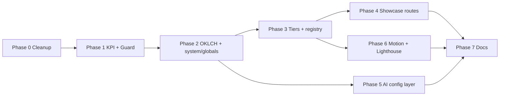

# Refinement Plan — AstroDeck-Style Alignment

> Goal: evolve `astro-sveltia-cloudflare` into an AI-operable, design-system-driven
> starter on par with [AstroDeck](https://www.astrodeck.dev/)
> ([GitHub](https://github.com/holger1411/astrodeck)), **without losing** the
> capabilities AstroDeck does not have: multilingual routing (en/id), Sveltia CMS,
> Cloudflare Pages + Functions, BetterAuth (D1/R2), OG image generation, RSS,
> sitemap, and Pagefind search.

This plan is reference + roadmap. It does not change code by itself. Each phase is
independently shippable and ordered low-risk first.

---

## 1. What AstroDeck does that we should adopt

From the AstroDeck README and site, the differentiators are:

1. **Explicit three-tier architecture** — Components (`ui/`) → Sections (`sections/`) → Pages, plus a machine-readable `src/registry.json` catalog.
2. **OKLCH design tokens** in a single `@theme` block (perceptually uniform, easy theming).
3. **Canonical design knowledge** in `system/globals/` (8 markdown files: colors, typography, spacing, interaction, imagery, effects, responsiveness, accessibility) — one source of truth referenced by every tool.
4. **Deterministic guardrails**: a convention-guard hook that blocks off-system edits (hardcoded colors, inline styles, deprecated imports, `tailwind.config.*`, relative `../` imports) and a single `check:kpis` script (the source of truth for `/audit` and `/launch-check`, usable in CI).
5. **Multi-tool AI config**: `AGENTS.md` (defaults) + `PROJECT.md` (highest-priority overrides) + `CLAUDE.md` + `.cursor/rules` + `.windsurfrules` + `.github/copilot-instructions.md`.
6. **`DESIGN.md`** bring-your-own-brand (Stitch-format) → one-off translation into tokens.
7. **Portable self-audit prompts** (`system/prompts/`) usable in any chat tool.
8. **A live `/sections` showcase** and `/pages` overview for discoverability.
9. **CSS-only animation system** via `data-animate` scroll attributes.
10. **Verified Lighthouse 100** out of the box.

## 2. What we already have (and must preserve)

| Capability | Status | Notes |
| --- | --- | --- |
| Reusable UI library | Have | `src/components/ui/**` (~25 components, barrel exports) |
| Layout shells | Have | `BaseLayout`, `Marketing/Page/Landing/Blog/Service` |
| Design tokens (Tailwind v4 `@theme`) | Have | `src/styles/tokens/*.css` + `global.css` |
| Dark mode (class strategy + FOUC script) | Have | `.dark`, localStorage bootstrap |
| i18n routing (en default, `/id/`) | Have | AstroDeck has none — keep it |
| Sveltia CMS content collections | Have | blog, services, pages, faqs, stack, authors, settings |
| Cloudflare Pages + Functions | Have | `wrangler.jsonc`, `functions/**` |
| BetterAuth + D1 + R2 + 2FA | Have | auth admin, media pipeline |
| SEO: OG images, JSON-LD, sitemap, RSS, robots, llms.txt | Have | dynamic `og/[...slug]`, `seo/**` |
| Pagefind search | Have | `SearchModal.astro` |
| Starlight docs | Have | `/docs` |
| Testing (Vitest + Playwright) | Have | unit + e2e |
| Prefetch navigation | Have | enabled in `astro.config.ts` (`prefetchAll`) |

## 3. Gap analysis → actions

| AstroDeck capability | This repo today | Action |
| --- | --- | --- |
| OKLCH tokens | Hex tokens | Convert `tokens/colors.css` to OKLCH; keep semantic names |
| Sections tier (named) | Landing components act as sections | Introduce `src/components/sections/` convention + barrel; map existing blocks |
| `registry.json` | None | Generate a machine-readable component/section/page catalog |
| `system/globals/` design KB | Scattered in CSS + memory.md | Author 8 canonical markdown files |
| `check:kpis` script | Partial (`lint`, `validate:*`) | Add `scripts/check-kpis.mjs` + `pnpm check:kpis` |
| Convention-guard hook | None | Add Cursor/Claude hook blocking off-system edits |
| `PROJECT.md` / `DESIGN.md` | None | Add both; wire into AGENTS.md |
| Portable self-audit prompts | `.agentkanban/prompts/*` (workflow) | Add design/quality self-audit prompts |
| `/sections` + `/pages` showcase | None | Build a localized component gallery route |
| `data-animate` animations | Ad-hoc | Add a reduced-motion-safe CSS animation utility |
| Verified Lighthouse | Placeholder "100" cards | Run real audits; replace hardcoded scores or label them |
| Legacy duplicate components | Present (dead code) | Remove after confirming unused |
| Multi-tool AI config | AGENTS.md (agentkanban) only | Add `.cursor/rules`, copilot/windsurf configs |

---

## 4. Phased roadmap

Phases are ordered so foundations land first. Each lists deliverables, key files, and acceptance criteria. Keep changes additive; do not break i18n/CMS/CF/auth.

### Phase 0 — Cleanup & guardrails foundation (low risk)
- Remove dead legacy duplicates after verifying zero imports: `src/components/{Header,Footer,ThemeToggle,Hero,CTA,FeatureGrid,SEO,Analytics,ShareButtons,TrustBlock}.astro` (the active versions live under `layout/`, `hero/`, `seo/`, `ui/`).
- Decide token strategy: keep the legacy-alias bridge OR migrate components to semantic tokens. Recommended: schedule full migration (Phase 2) and drop the bridge at the end.
- Files: `src/components/*.astro` (deletions), `src/components/index*`.
- Acceptance: `pnpm build` + `astro check` pass with the duplicates gone.

### Phase 1 — KPI script + convention guard (the AstroDeck core)
- Add `scripts/check-kpis.mjs` running static checks: hardcoded Tailwind colors (`bg-red-500` etc.), inline `style=`, non-token hex in components, deprecated imports (`ViewTransitions`, `z` from `astro:content`), missing `alt`, missing meta description, `tailwind.config.*` presence.
- Wire `"check:kpis"` into `package.json` and fold it into `lint`.
- Add an editor hook that warns/blocks off-system edits (Cursor hook + `.claude/hooks/guard-conventions.mjs` equivalent).
- Files: `scripts/check-kpis.mjs`, `package.json`, `.cursor/hooks` or `.claude/hooks/`.
- Acceptance: `pnpm check:kpis` runs clean (or lists only intentional exceptions); CI-friendly exit codes.

### Phase 2 — OKLCH design system + canonical knowledge base
- Convert `src/styles/tokens/colors.css` to OKLCH (`oklch(L% C H)`), keeping semantic names and light/dark parity; update shadows.
- Author `system/globals/` (8 files): `colors.md`, `typography.md`, `spacing.md`, `interaction.md`, `imagery.md`, `effects.md`, `responsiveness.md`, `accessibility.md` — the single source of truth, referenced by AGENTS.md and prompts.
- Migrate components off the legacy-alias bridge to semantic tokens; then delete the bridge added in the homepage refinement.
- Files: `src/styles/tokens/*.css`, `src/styles/global.css`, `system/globals/*.md`, component styles.
- Acceptance: `check:kpis` confirms no non-OKLCH tokens / no hardcoded colors; dark mode verified; visual parity.

### Phase 3 — Three-tier architecture + registry
- Establish `src/components/sections/` as the named "Sections" tier; relocate/alias landing + marketing blocks (`Hero`, `FeatureTabs`, `StackMarquee`, `Credibility`, `LighthouseScores`, `CTA`, `FAQ`, `Stats`, `LogoCloud`, `Testimonials`, `Newsletter`, `Contact`, `Pricing`, `Team`, `Comparison`) with barrel exports.
- Add `src/registry.json` (machine-readable: name, tier, path, props summary, i18n-aware).
- Backfill missing high-value sections AstroDeck has (Pricing, Testimonials, Team, Comparison, Newsletter, LogoCloud, Stats) as localized Astro components.
- Files: `src/components/sections/**`, `src/registry.json`.
- Acceptance: every section imported from one barrel; `registry.json` validated by a small script.

### Phase 4 — Showcase routes (`/sections`, `/pages`, `/docs` cross-link)
- Build a localized `/sections` gallery with live previews (en + id) and a `/pages` overview, mirroring AstroDeck's discoverability.
- Respect existing i18n routing (`/sections` and `/id/sections`).
- Files: `src/pages/sections.astro` + `src/pages/[locale]/sections.astro`, `pages.astro` equivalents.
- Acceptance: routes build for both locales; no horizontal overflow; dark mode complete.

### Phase 5 — AI operability layer (multi-tool)
- Add `PROJECT.md` (highest-priority project overrides) and `DESIGN.md` support; add a short AGENTS.md note so any agent applies `DESIGN.md` → tokens.
- Add `.cursor/rules/*.mdc`, `.github/copilot-instructions.md`, `.windsurfrules` that reference `system/globals/` and `check:kpis`.
- Add portable self-audit prompts under `system/prompts/` (tokens, a11y, performance, seo, darkmode, responsive, cascade) — distinct from the existing `.agentkanban/prompts/` workflow prompts.
- Files: `PROJECT.md`, `DESIGN.md` (template), `.cursor/rules/**`, `.github/copilot-instructions.md`, `.windsurfrules`, `system/prompts/**`, `AGENTS.md` (note).
- Acceptance: each tool config points to one canonical KB; no duplicated design truth.

### Phase 6 — Motion, polish, and verified performance
- Add a reduced-motion-safe `data-animate` scroll-reveal utility in `global.css` (CSS-only; honors `prefers-reduced-motion`).
- Run real Lighthouse audits (Playwright/Lighthouse MCP) for `/` en + id; either wire live scores into `LighthouseScores` or clearly label them as targets.
- Files: `src/styles/global.css`, `src/components/sections/LighthouseScores.*`, audit script.
- Acceptance: documented Lighthouse ≥95 (target 100) on key routes; motion respects reduced-motion.

### Phase 7 — Docs & contributor experience
- Update `README.md` with the three-tier model, `check:kpis`, AI pathways table (Cursor/Copilot/Claude/Codex), and Cloudflare deploy.
- Update `TECHNICAL.md` and `.agentkanban/memory.md` to reflect the new system.
- Files: `README.md`, `TECHNICAL.md`, `.agentkanban/memory.md`.
- Acceptance: a new contributor (human or agent) can build a page from sections following docs alone.

### Phase 8 — Blog UI/UX refinement & running logo stacks (focused fix)
- **Running logo stack (`StackMarquee`)**: fix the clone class concatenation bug (missing space produced `stack-marquee__itemstack-marquee__item--clone`, stripping pill styling from the duplicated badges so they overlapped unstyled). Ensure cloned badges are visually identical, the loop is seamless, monochrome-consistent, and reduced-motion wraps cleanly.
- **Blog article layout (`BlogLayout`)**: fix the TOC/article column inversion — the `<aside>` is DOM-first so it landed in the wide `1fr` column while the article was squeezed into `18rem` (giant empty TOC card + clipped code blocks). Place the article in the wide column and the TOC in a narrow right rail via explicit grid placement, independent of DOM order.
- **Table of contents (`TableOfContents`)**: make the sidebar sticky with its own scroll, add an active-section accent, and align styling with the monochrome system.
- **Reading experience**: cap the article measure (~72ch) for readability, keep code blocks/images within the column (no horizontal overflow), verify dark mode.
- Files: `src/components/landing/StackMarquee.astro`, `src/layouts/BlogLayout.astro`, `src/components/blog/TableOfContents.astro`.
- Acceptance: `pnpm build` + `stylelint` pass; marquee badges all styled and looping; blog content wide with TOC on the right; no clipped code blocks at 1440/1024/375; light + dark verified.

---

## 5. Suggested sequencing

Minimum viable "AstroDeck parity" = Phases 0–3 + 5. Phases 4, 6, 7 are polish/discoverability.

## 6. Guiding principles
- Preserve i18n, Sveltia CMS, Cloudflare (Pages + Functions), BetterAuth, SEO, RSS, sitemap, Pagefind, Starlight at all times.
- One source of truth for design (`system/globals/` + `@theme`); no duplicated token tables.
- Additive first; delete legacy only after proving it is unused.
- No heavy dependencies; keep React islands minimal; static Astro by default.
- Every phase ends green: `pnpm build`, `astro check`, `pnpm lint`, `pnpm check:kpis`, `pnpm test`.

## 7. Risks & mitigations
- OKLCH conversion drift → snapshot before/after screenshots per phase.
- Token migration breaking shared chrome → migrate behind the alias bridge, remove bridge last.
- i18n duplication when adding routes → always add both `src/pages/x.astro` and `src/pages/[locale]/x.astro`.
- Guard hook false positives → start in "warn" mode, promote to "block" once stable.

## 8. Out of scope
- Replacing Sveltia CMS, Cloudflare, or BetterAuth with AstroDeck's Vercel/shadcn defaults.
- Dropping i18n. Dropping Starlight docs.

---

### References
- AstroDeck site: https://www.astrodeck.dev/
- AstroDeck repo: https://github.com/holger1411/astrodeck
